# Crypt of Secrets


##  Table of Contents

1. [About the Project](#1-about-the-project)
   - 1.1 [Project Description](#11-project-description)
   - 1.2 [Built With](#12-built-with)
2. [Getting Started](#2-getting-started)
   - 2.1 [Prerequisites](#21-prerequisites)
   - 2.2 [How to Install](#22-how-to-install)
3. [Features and Usage](#3-features-and-usage)
   - [Screenshots & Explanations](#screenshots--explanations)
4. [Demonstration Video](#4-demonstration-video)
5. [Architecture / System Design](#5-architecture--system-design)
6. [Design Concept](#6-design-concept)
   - 6.1 [Mockups](#61-mockups)
7. [Highlights and Challenges](#7-highlights-and-challenges)
8. [Roadmap – Future Improvements](#8-roadmap--future-improvements)
9. [License](#9-license)
10. [Authors and Contact Info](#10-authors-and-contact-info)
11. [Acknowledgements](#11-acknowledgements)

---

## 1. About the Project

### 1.1 Project Description

**Crypt of Secrets** is a full stack anonymous confession platform built with a gothic atmosphere heavily inspired by *Cult of the Lamb* and vintage gothic culture. Users "confess" their petty misdeeds and petty crimes - the small, memorable things people don't forget - to a mysterious, unnamed leader who reviews each confession before it's approved to the crypt. What confessors don't know is that the leader is the admin, hidden in plain sight.

Once approved, confessions are posted anonymously for the community to read. Other users vote on whether they believe each confession is **true** or **false**, and the more true votes a post receives, the more it rises in popularity. Users can also award posts they love with mini tarot cards, which the recipient can collect and trade in for temporary buffs that boost their post's visibility.

Trust is earned, not given: every user starts out completely anonymous, posting under a blank "Anonymous" profile. As their reputation builds through votes on their confessions, they unlock the ability to select an animal-themed username and profile picture, slowly stepping out of the shadows.

The application is built with **PHP and MySQL**, developed locally using **XAMPP**, with a focus on a cohesive gothic aesthetic and a tight, ritual-like user loop of confessing, judging, and rewarding.


### 1.2 Built With

#### Frontend


#### Backend


#### Database


#### Local Environment


---

## 2. Getting Started

### 2.1 Prerequisites

- [XAMPP](https://www.apachefriends.org/) (bundles Apache, MySQL, and PHP)
- A code editor (e.g. VS Code)
- Git

### 2.2 How to Install

1. **Clone the Repository**

Clone the project directly into your XAMPP `htdocs` folder so Apache can serve it:

```bash
cd C:/xampp/htdocs   # idk how to do mac
git clone https://github.com/your-username/crypt-of-secrets.git
```

2. **Start Apache and MySQL**

Open the XAMPP Control Panel and start both the **Apache** and **MySQL** modules.

3. **Create the Database**

- Open [phpMyAdmin](http://localhost/phpmyadmin) in your browser.
- Create a new database (e.g. `crypt_of_secrets`).
- Import the provided `.sql` file from the project's `/database` folder to set up all tables.

4. **Configure the Database Connection**

Update your PHP database config file (e.g. `config/db.php`) with your local credentials:

```php
<?php
$host = "localhost";
$db_user = "root";
$db_pass = "";
$db_name = "crypt_of_secrets";
```

5. **Run the Project**

Visit the project in your browser via:

```
http://localhost/crypt-of-secrets/
```

---

## 3. Features and Usage

- **Anonymous Confession System**: Users submit confessions ("posts") which are reviewed by the leader (the hidden admin) before being approved to appear on the crypt. Drafts can be saved and resumed later.
- **Truth Voting**: The community votes whether they believe each confession is **true** or **false**. Voting is handled by a JSON endpoint so the feed updates in place without a page reload.
- **Tarot Fragments & Cards**: Voting has a chance to drop 1 of 4 fragments of a random tarot card. Collect all four and the card assembles itself into your collection.
- **Awarding**: Awarding another user's confession gifts them a random fragment you hold. It never buffs their post, and you cannot award your own.
- **Self-Buffing**: A fully assembled card can be spent on one of your *own* confessions from the Analytics page, applying a timed buff.
- **Reputation & Trust System**: Every user starts anonymous. Once trust passes the threshold, a hammer icon appears in the nav and they may claim an animal identity, choosing from a set of alliterative names matched to their chosen animal.
- **Leader Dashboard**: The hidden admin reviews the pending queue, admits or denies confessions (optionally with a reason), and can review past decisions. The leader's own posts skip the queue.
- **Notifications**: Approvals, denials, awards received, fragments gained, votes received, and trust milestones all raise notifications, with an unread badge on the bell.
- **Profile & Analytics**: Trust index, confession counts, views, collected cards, a 7-day vote trend, and progress rings toward the next milestone.
- **Responsive Layout**: The side navigation collapses to a hamburger drawer on mobile, and the icon row becomes a fixed bottom bar.
- **Gothic, Ritual-Inspired UI**: A dark, candlelit aesthetic inspired by *Cult of the Lamb*, with hand-drawn rough borders rendered via SVG turbulence filters and a WebGL shader for the animated navigation edge.

### Screenshots/Explanations

**Splash Screen**

The welcome screen introducing users to the Crypt of Secrets, with a "Confess" call to action.


**Sign Up**

Where users create an anonymous account. Every new account begins fully anonymous, with a generated handle and the default lamb avatar.


**Log In**

Returning confessors log in here. Inputs use the same hand-drawn rough border as the rest of the site.

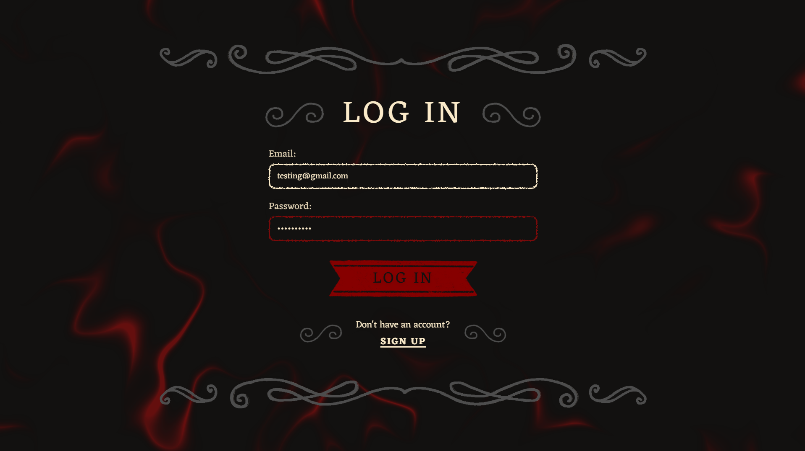

**Home Feed**

The main feed of approved confessions, with filter and sort controls, True/False voting, and the Award action. Voting happens without a page reload, and each post shows its view count and vote ratio.

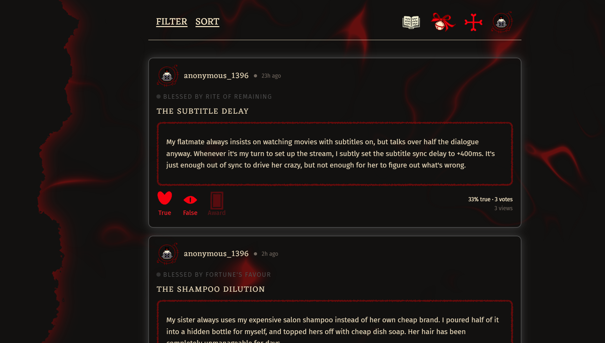

**Mini Profile**

Clicking a confessor's avatar opens a tarot-styled card showing their confession count, trust rating, cards collected, and how often they're believed.

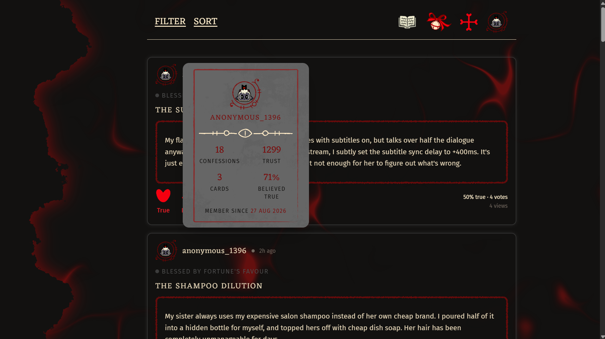

**Create Post**

The confession form, with title and body fields. Confessions can be saved as drafts and resumed later via the View Drafts menu, or sent to the leader for review.

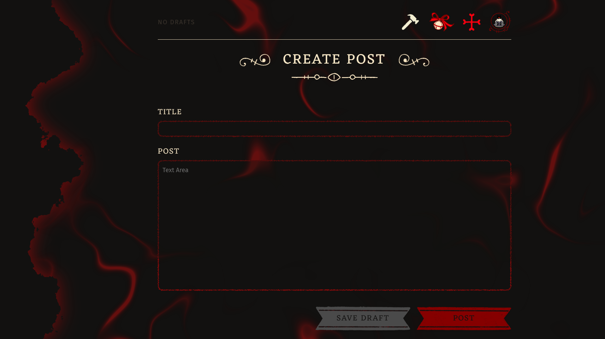

**Profile Page**

A confessor's own profile: their avatar and claimed name, trust index, confession and vote totals, collected tarot cards, and tabs filtering their posts by how the crypt judged them.

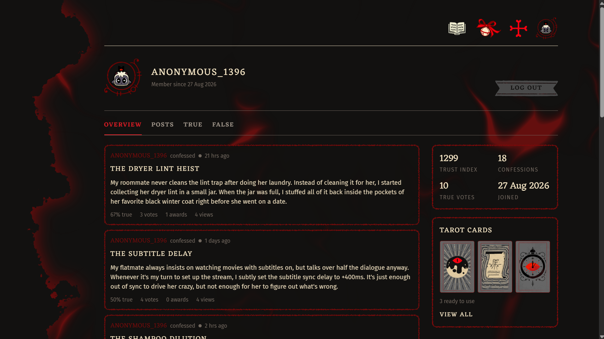

**Analytics Page**

Progress rings toward the next trust milestone, stat tiles, and a 7-day trend of votes received. The Buffs tab is where a fully assembled card is spent on one of your own confessions.

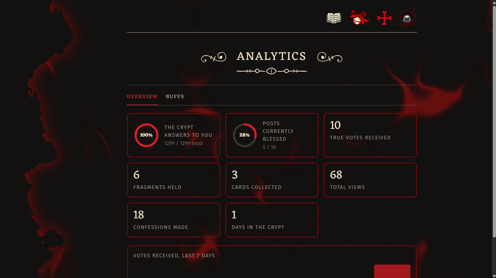

**Awards Page (Locked)**

Cards still being assembled show diamond pips marking how many of the four fragments have been collected.

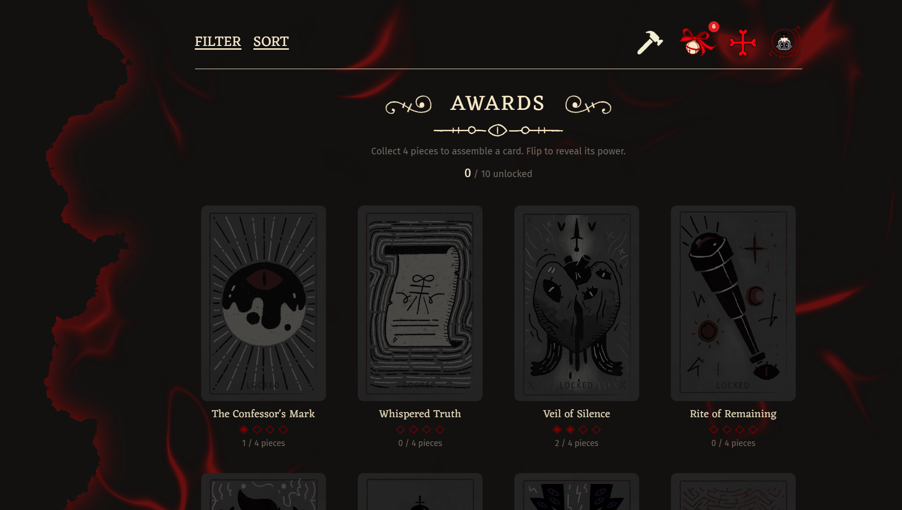

**Awards Page (Unlocked)**

Assembled cards can be flipped to reveal their effect and duration on the reverse.

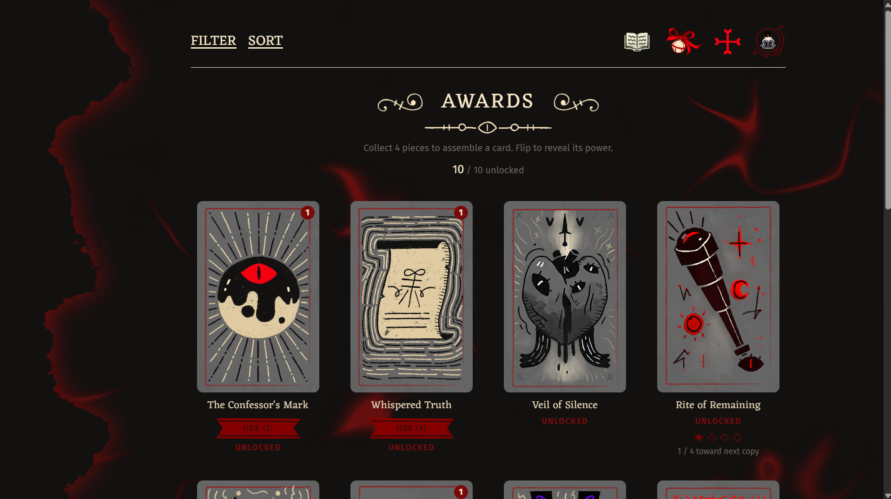

**Notifications**

Approvals, denials, awards, fragment drops, and trust milestones collect here, with an unread badge on the bell icon until they're read.

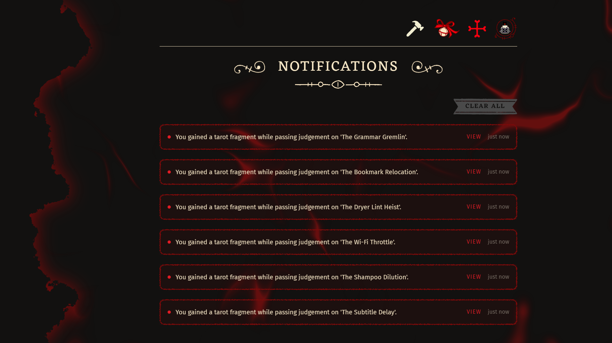

**Clear Notifications**

Destructive actions use an in-page confirmation styled to match the site rather than a browser dialogue.

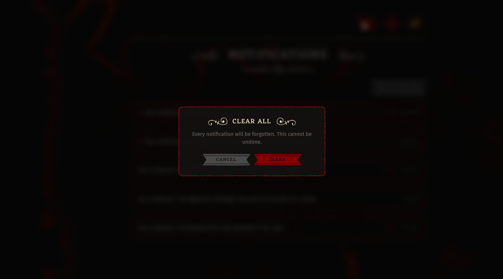

**Side Navigation**

The gooey animated navigation, whose torn edge is drawn by a WebGL shader computing noise each frame rather than an animated SVG filter. On mobile it collapses into a hamburger drawer.

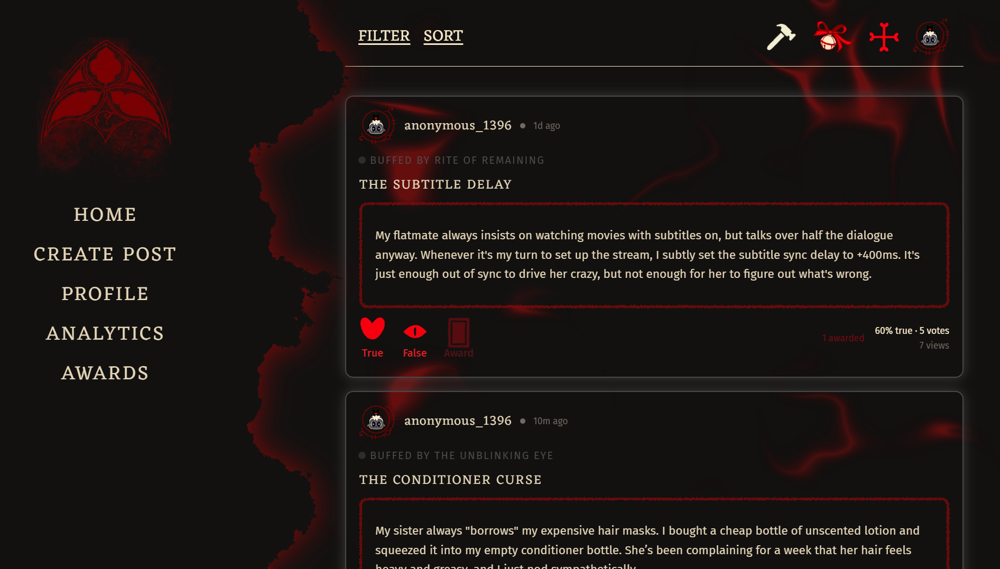

**Shed Your Silence**

Once trust passes the threshold, confessors may claim a face and a name. Locked animals show the trust still required, and the name options are alliterative to whichever animal is chosen.

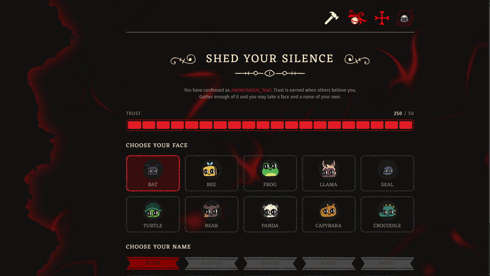

**Leader Dashboard**

The hidden admin's view: the pending queue with admit and deny actions, tabs for reviewing past decisions, and dashboard tiles summarising the crypt's activity. Denials may carry a reason, which the author sees without ever learning who ruled on it.

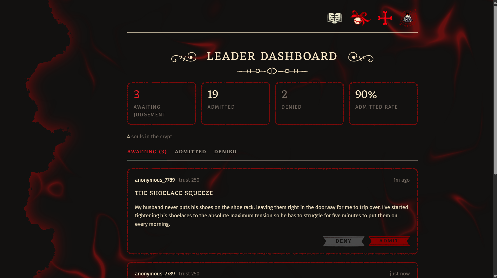

---

## 4. Demonstration Video

[Watch the demonstration video](https://drive.google.com/drive/folders/18Syy8-nWcXDdkl7wROu4SFLTbb1c7mVi?usp=drive_link)

---

## 5. Architecture / System Design

- **Frontend**:
  - **Responsibility**: Renders the confession feed, forms, and profile views; handles client-side interactions (voting, filtering, sorting).
- **Backend**:
  - **Responsibility**: Written in PHP, handles authentication, confession approval logic, voting, tarot card/buff logic, and all database interactions.
- **Database**: A relational MySQL database.
  - **Responsibility**: Stores all persistent data — users, posts, truth votes, tarot card buffs, and post awards.

#### Entity Relationship Diagram

The database is structured around the following core entities:

- **users** - `user_id`, `email`, `role`, `is_anonymous`, `anon_handle`, `animal_username`, `avatar_id`, `trust_index`, `created_at`
- **posts** - `post_id`, `author_id`, `title`, `content`, `status`, `posted_anonymously`, `review_note`, `reviewed_by`, `reviewed_at`, `active_buff_id`, `buff_expires_at`
- **truth_voting** - `vote_id`, `post_id`, `voter_id`, `is_true` (unique per post/voter)
- **tarot_card_buffs** - `tarot_id`, `tarot_name`, `effect_type`, `effect_value`, `buff_duration`, `rarity`
- **user_tarot_pieces** - `piece_id`, `user_id`, `tarot_id`, `piece_number` (the 1-of-4 fragments)
- **award_collection** - `collection_id`, `user_id`, `tarot_id`, `quantity` (assembled cards)
- **post_awards** - `award_instance_id`, `post_id`, `giver_id`, `tarot_id`
- **post_views** - `view_id`, `post_id`, `viewer_id` (unique per pair, so views count people not refreshes)
- **animal_avatars** - `avatar_id`, `animal_name`, `filename`, `display_filename`, `min_trust`
- **notifications** - `notification_id`, `user_id`, `type`, `post_id`, `is_read`
- **avatar_submissions** - `submission_id`, `user_id`, `filename`, `status` (schema only; custom avatar uploads are not yet built)

Relationships: a `user` **creates** `posts`, **votes on** posts via `truth_voting`, earns
`user_tarot_pieces` which assemble into their `award_collection`, **gifts** fragments
recorded in `post_awards`, and the leader **rules on** posts (`reviewed_by`).

  

---

## 6. Design Concept

The visual identity of Crypt of Secrets draws heavily from *Cult of the Lamb*'s gothic-cute art direction, alongside vintage gothic architecture and tarot card imagery, cathedral silhouettes, and color tones extracted directly from the game.

**Color Palette**

| Black | Dark Red | Red | Cream |
|:---:|:---:|:---:|:---:|
| `#121110` | `#7A0A0A` | `#E11C25` | `#FAEAC9` |

The navy originally planned for buffed posts was dropped: against the near-black
background it was too dark to read as a highlight, and a mid grey replaced it.

**Fonts**

- **Eczar** — headings
- **Fira Sans** — body text

**Constraints & Concept Notes**

- Some things deserve to be remembered - the confession is permanent once posted.
- Anonymous until trusted - usernames only appear once reputation is earned.
- The admin (leader) is never named or seen.

### 6.1 Mockups

The interface shown across desktop, laptop, and mobile.

**Desktop**

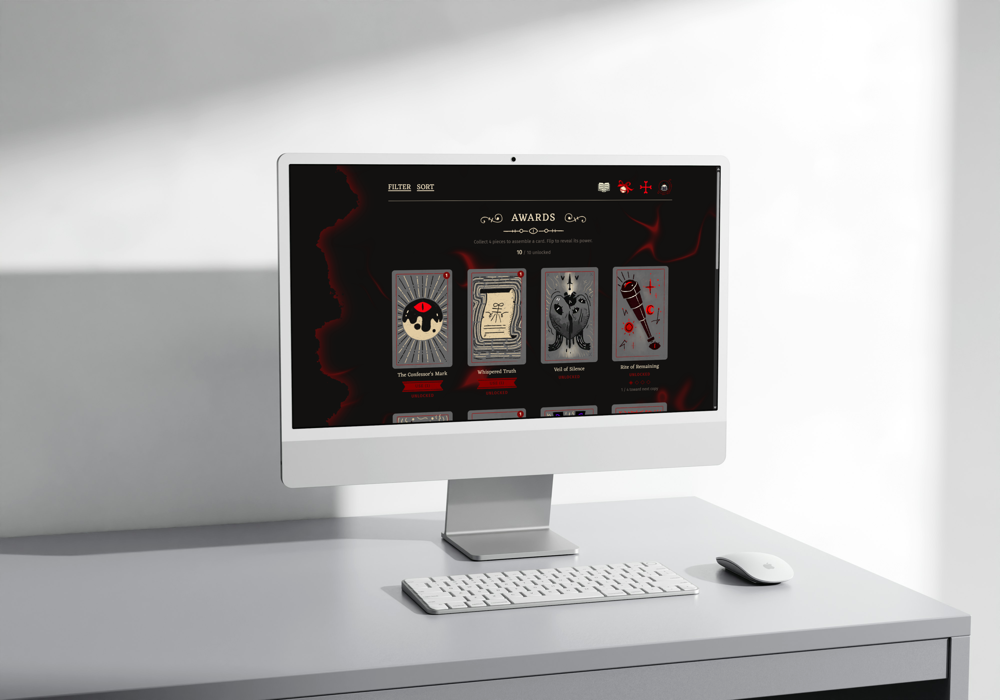


**Laptop**

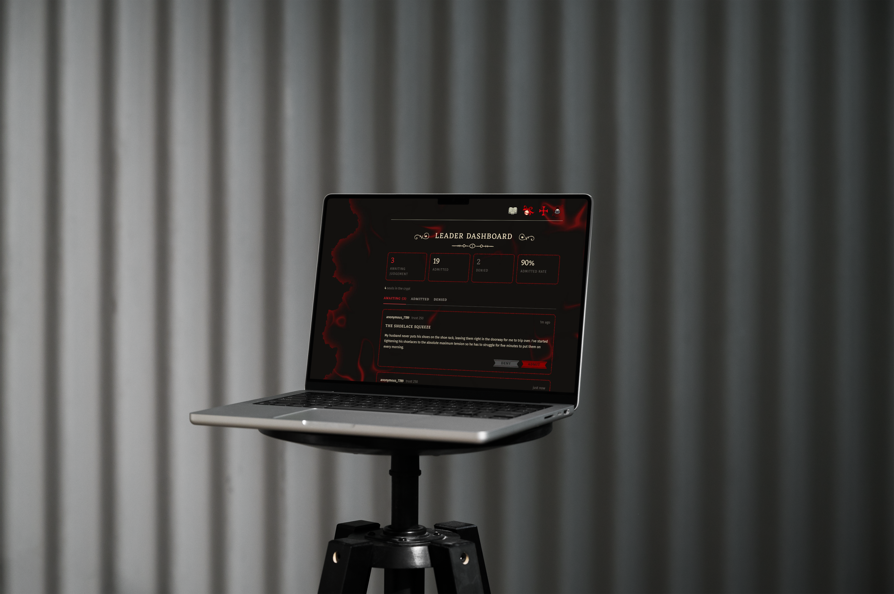

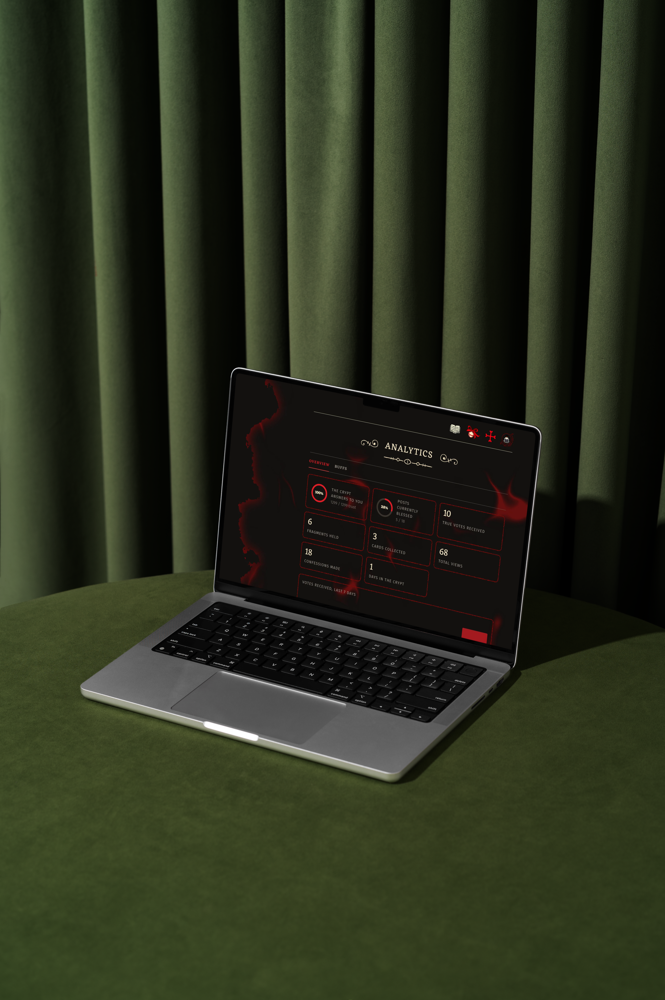

**Phone**

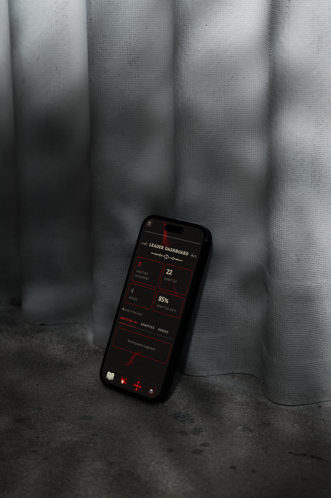

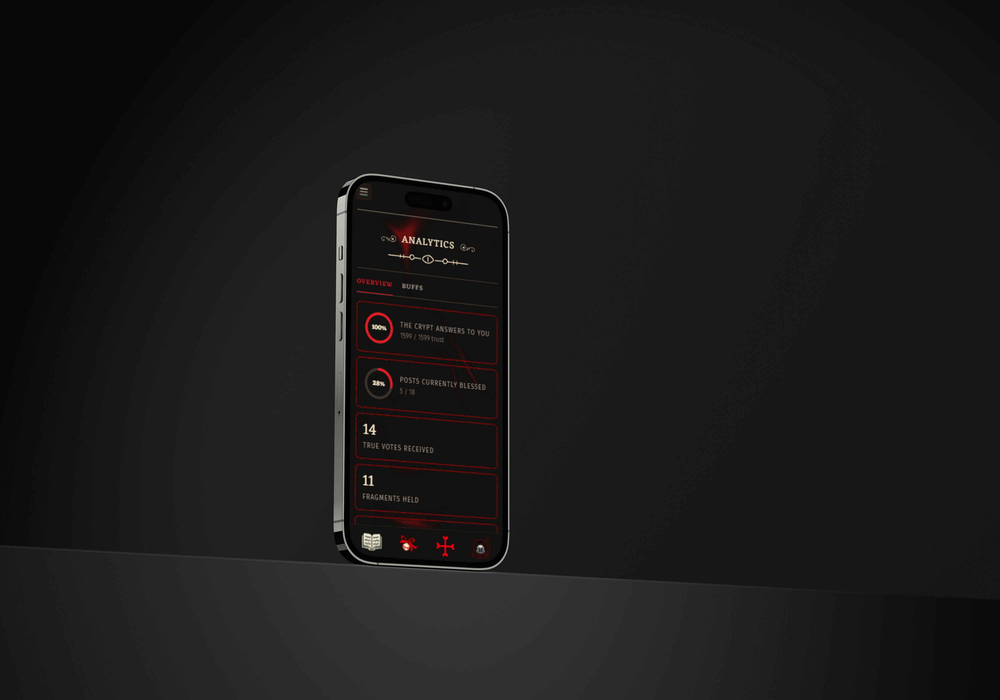

---

## 7. Highlights and Challenges

### Highlights

- Designing a cohesive gothic/ritual visual theme from scratch, inspired by Cult of the Lamb.
- Building the truth-voting and reputation system to gate anonymous to claimed profiles.
- Structuring the tarot fragment, assembly, and buff system across four related tables.
- Using PDO with `EMULATE_PREPARES => false`, so statements are genuinely prepared and sent separately from their data rather than string-escaped.
- Whitelisting sort and filter options as fixed SQL fragments looked up by array key, which keeps dynamic `ORDER BY` and `HAVING` safe where parameters aren't permitted.

### Challenges

- **Balancing anonymity with moderation.** The leader must be able to judge confessions without the author ever learning who ruled on them, so denial reasons reach the author while `reviewed_by` stays on the dashboard.
- **Vote farming.** Flipping a vote back and forth would otherwise repeat trust gains and fragment drops, so `rowCount()` distinguishes a genuinely new vote from a changed one.
- **Animated SVG filters degrading.** The navigation edge was first built by mutating an SVG turbulence filter every frame, which browsers stop rendering correctly after sustained runtimes. It was rewritten as a WebGL shader computing the torn edge from noise, so it can run indefinitely.
- **Oversized image assets.** The tarot card backs were 29-megapixel PNGs displayed at 210x330px, which stalled the flip animation and, counter-intuitively, made them look pixelated: at that ratio browsers fall back to low-quality sampling. Resizing them to 630x952 cut 46MB to 3.4MB and fixed both symptoms.

---

## 8. Roadmap – Future Improvements

- Live analytics dashboard for post performance.
- Additional tarot card types with unique buff effects.
- Direct messaging between trusted users.
- Ability to report or flag inappropriate confessions.
- Expanded admin dashboard for confession moderation.

---

## 9. License

### License

Distributed under the MIT License.

---

## 10. Authors and Contact Info

- **[Rhichelle Strauss]** – Developer and Designer

---

## 11. Acknowledgements

- **_Cult of the Lamb_ (Massive Monster / Devolver Digital)** for the visual and thematic
  direction of this project. Many assets were sourced from the community-maintained
  [Cult of the Lamb Wiki](https://cult-of-the-lamb.fandom.com/wiki/Cult_of_the_Lamb_Wiki):
  some are used directly, some were edited or recoloured to suit this interface, and
  others were recreated from scratch in the same style. All rights to the original art,
  character design, and aesthetic belong entirely to Massive Monster and Devolver Digital.
  This is a non-commercial student project created for academic purposes only. It is not
  for sale, is not distributed commercially, and is neither affiliated with nor endorsed
  by Massive Monster or Devolver Digital.
- **[React Bits](https://reactbits.dev/)** for the ferrofluid background effect that the
  animated shader work in this project is based on.
- **Claude (Anthropic)** for development assistance, particularly in helping me understand
  and diagnose bugs rather than simply patching them, and for explaining unfamiliar
  concepts such as WebGL shaders, image decoding and optimisation, and CSS stacking
  contexts. All design decisions, game mechanics, and visual direction are my own.
- **Gemini (Google)** for generating the dummy confession content used to populate and
  test the feed.
- **Tsungai Katsuro** - my lecturer.
