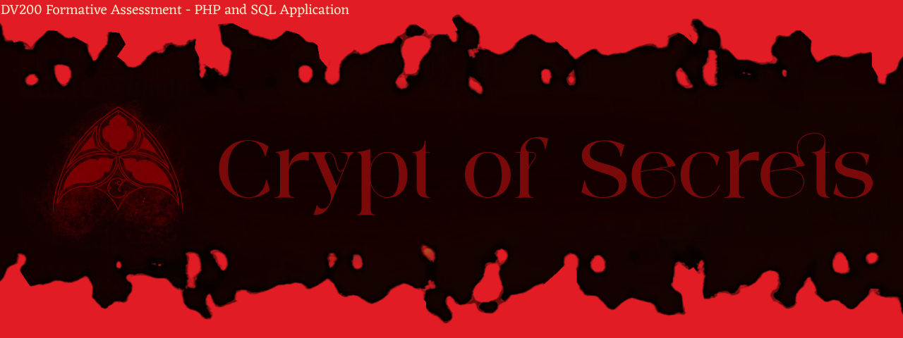
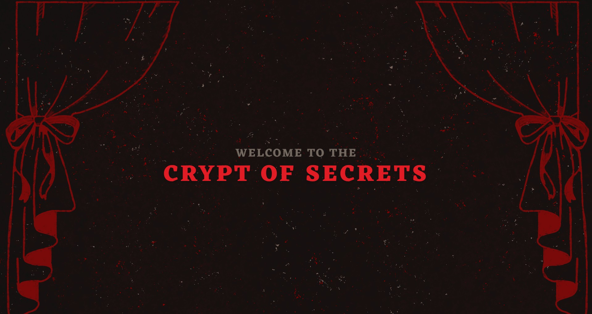
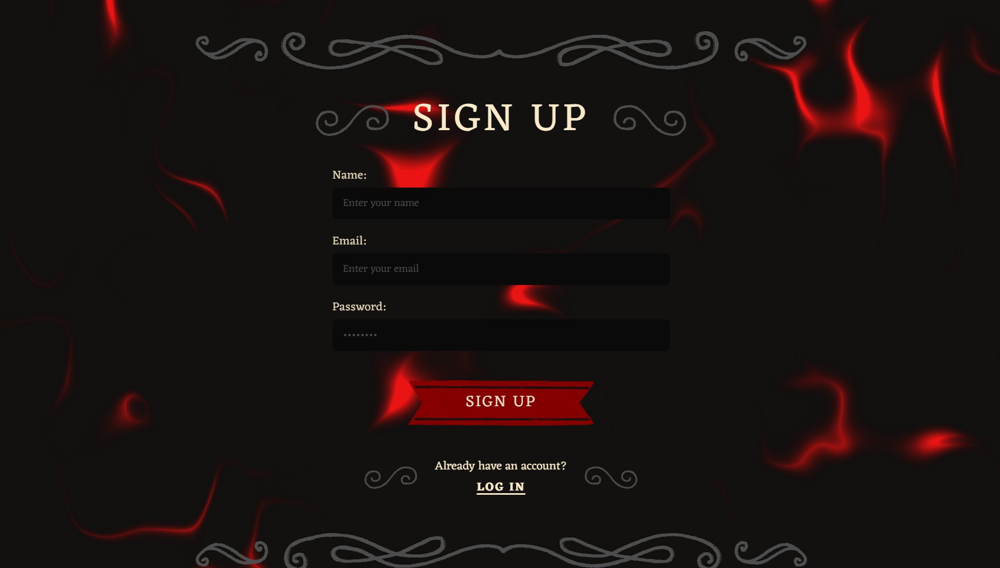
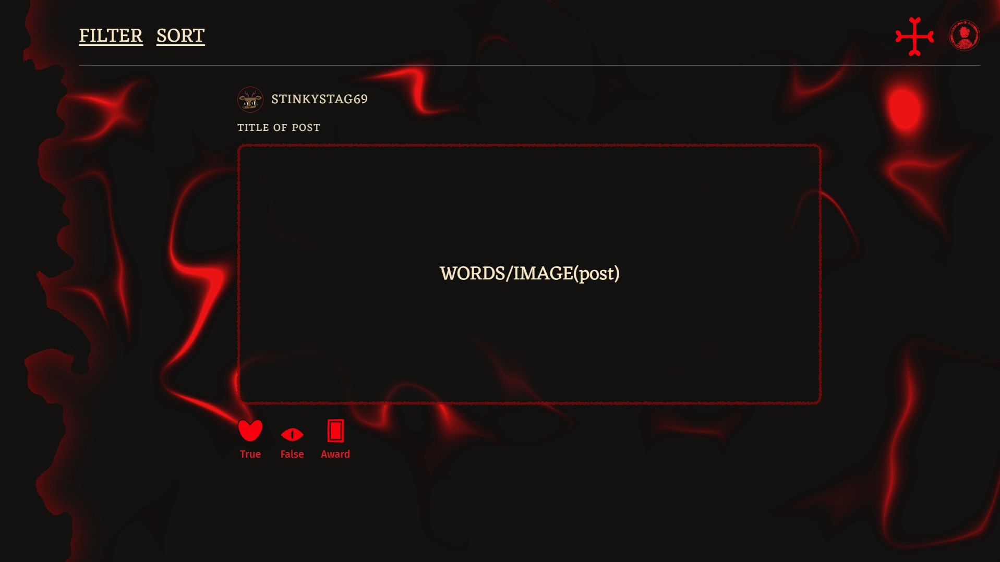
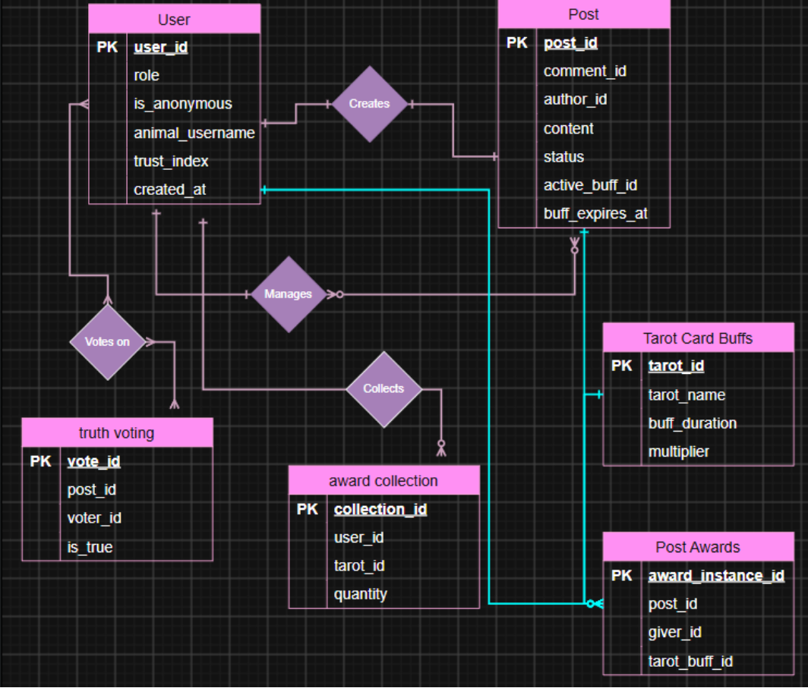

# Crypt of Secrets




##  Table of Contents

1. [About the Project](#1-about-the-project)
   - 1.1 [Project Description](#11-project-description)
   - 1.2 [Built With](#12-built-with)
2. [Getting Started](#2-getting-started)
   - 2.1 [Prerequisites](#21-prerequisites)
   - 2.2 [How to Install](#22-how-to-install)
3. [Features and Usage](#3-features-and-usage)
   - [Screenshots & Explanations](#screenshots--explanations)
4. [Demonstration Video](#4-demonstration-video)
5. [Architecture / System Design](#5-architecture--system-design)
6. [Design Concept](#6-design-concept)
7. [Highlights and Challenges](#7-highlights-and-challenges)
8. [Roadmap – Future Improvements](#8-roadmap--future-improvements)
9. [License](#9-license)
10. [Authors and Contact Info](#10-authors-and-contact-info)
11. [Acknowledgements](#11-acknowledgements)

---

## 1. About the Project

### 1.1 Project Description

**Crypt of Secrets** is a full stack anonymous confession platform built with a gothic atmosphere heavily inspired by *Cult of the Lamb* and vintage gothic culture. Users "confess" their petty misdeeds and petty crimes - the small, memorable things people don't forget - to a mysterious, unnamed leader who reviews each confession before it's approved to the crypt. What confessors don't know is that the leader is the admin, hidden in plain sight.

Once approved, confessions are posted anonymously for the community to read. Other users vote on whether they believe each confession is **true** or **false**, and the more true votes a post receives, the more it rises in popularity. Users can also award posts they love with mini tarot cards, which the recipient can collect and trade in for temporary buffs that boost their post's visibility.

Trust is earned, not given: every user starts out completely anonymous, posting under a blank "Anonymous" profile. As their reputation builds through votes on their confessions, they unlock the ability to select an animal-themed username and profile picture, slowly stepping out of the shadows.

The application is built with **PHP and MySQL**, developed locally using **XAMPP**, with a focus on a cohesive gothic aesthetic and a tight, ritual-like user loop of confessing, judging, and rewarding.


### 1.2 Built With

#### Frontend


#### Backend


#### Database


#### Local Environment


---

## 2. Getting Started

### 2.1 Prerequisites

- [XAMPP](https://www.apachefriends.org/) (bundles Apache, MySQL, and PHP)
- A code editor (e.g. VS Code)
- Git

### 2.2 How to Install

1. **Clone the Repository**

Clone the project directly into your XAMPP `htdocs` folder so Apache can serve it:

```bash
cd C:/xampp/htdocs   # idk how to do mac
git clone https://github.com/your-username/crypt-of-secrets.git
```

2. **Start Apache and MySQL**

Open the XAMPP Control Panel and start both the **Apache** and **MySQL** modules.

3. **Create the Database**

- Open [phpMyAdmin](http://localhost/phpmyadmin) in your browser.
- Create a new database (e.g. `crypt_of_secrets`).
- Import the provided `.sql` file from the project's `/database` folder to set up all tables.

4. **Configure the Database Connection**

Update your PHP database config file (e.g. `config/db.php`) with your local credentials:

```php
<?php
$host = "localhost";
$db_user = "root";
$db_pass = "";
$db_name = "crypt_of_secrets";
```

5. **Run the Project**

Visit the project in your browser via:

```
http://localhost/crypt-of-secrets/
```

---

## 3. Features and Usage

- **Anonymous Confession System**: Users submit confessions ("posts") which are reviewed by the leader (the hidden admin) before being approved to appear on the crypt.
- **Truth Voting**: The community votes whether they believe each confession is **true** or **false**, driving how prominently a post is featured.
- **Tarot Card Awards**: Users can award posts they love with tarot cards. Recipients collect these and trade them in for temporary buffs that boost their post's reach.
- **Reputation & Trust System**: All users start anonymous with a blank profile. As trust builds through community-voted posts, users unlock a custom animal username and profile picture.
- **Create & Manage Posts**: A dedicated create-post flow with title and body fields, plus save-draft and post actions.
- **Profile & Analytics**: Users can view their trust rating, notable awards, and post analytics.
- **Side Navigation**: Persistent navigation for Home, Create Post, Profile, Analytics, and Awards.
- **Gothic, Ritual-Inspired UI**: A dark, candlelit aesthetic inspired by *Cult of the Lamb* and vintage gothic design.

### Screenshots/Explanations


**Splash Screen**
- The welcome screen introducing users to the Crypt of Secrets, with a "Confess" call to action.
  

**Log In / Sign Up**
- Where users log in or create an anonymous account.


**Home Feed**
- Shows confession posts with filter and sort options, along with True/False voting and Award actions.
 

**Create Post**
- The confession form, where users submit a title and their confession text.

**Mini Profile**
- A popover preview showing a user's follower count, trust rating, notable awards, and member-since date.

**Awards Page**
- Displays the collection of tarot card awards a user has earned.

---

## 4. Demonstration Video

coming soon

---

## 5. Architecture / System Design

- **Frontend**:
  - **Responsibility**: Renders the confession feed, forms, and profile views; handles client-side interactions (voting, filtering, sorting).
- **Backend**:
  - **Responsibility**: Written in PHP, handles authentication, confession approval logic, voting, tarot card/buff logic, and all database interactions.
- **Database**: A relational MySQL database.
  - **Responsibility**: Stores all persistent data — users, posts, truth votes, tarot card buffs, and post awards.

#### Entity Relationship Diagram

The database is structured around the following core entities:

- **User** - `user_id`, `role`, `is_anonymous`, `animal_username`, `trust_index`, `created_at`
- **Post** - `post_id`, `comment_id`, `author_id`, `content`, `status`, `active_buff_id`, `buff_expires_at`
- **Truth Voting** - `vote_id`, `post_id`, `voter_id`, `is_true`
- **Tarot Card Buffs** - `tarot_id`, `tarot_name`, `buff_duration`, `multiplier`
- **Award Collection** - `collection_id`, `user_id`, `tarot_id`, `quantity`
- **Post Awards** - `award_instance_id`, `post_id`, `giver_id`, `tarot_buff_id`

Relationships: a `User` **Creates** `Posts`, **Votes on** posts (Truth Voting), **Collects** tarot cards into their Award Collection, and the admin (leader) **Manages** post approvals.

  

---

## 6. Design Concept

The visual identity of Crypt of Secrets draws heavily from *Cult of the Lamb*'s gothic-cute art direction, alongside vintage gothic architecture and tarot card imagery, cathedral silhouettes, and color tones extracted directly from the game.

**Color Palette**

| Black | Grey | Red | Dark Red | Navy | Cream |
|:---:|:---:|:---:|:---:|:---:|:---:|
| `#000000` | `#7A7267` | `#F0192A` | `#7A0E0E` | `#0F1E5C` | `#F4E9C9` |

**Fonts**

- **Eczar** — headings
- **Fira Sans** — body text

**Constraints & Concept Notes**

- Some things deserve to be remembered - the confession is permanent once posted.
- Anonymous until trusted - usernames only appear once reputation is earned.
- The admin (leader) is never named or seen.

---

## 7. Highlights and Challenges

### Highlights

- Designing a cohesive gothic/ritual visual theme from scratch, inspired by Cult of the Lamb.
- Building the truth-voting and reputation system to gate anonymous → custom profiles.
- Structuring the tarot card award and buff system in the database.

### Challenges

- Balancing the anonymous confession concept with a usable, moderated experience.

---

## 8. Roadmap – Future Improvements

- Live analytics dashboard for post performance.
- Additional tarot card types with unique buff effects.
- Direct messaging between trusted users.
- Ability to report or flag inappropriate confessions.
- Expanded admin dashboard for confession moderation.

---

## 9. License

### License

Distributed under the MIT License.

---

## 10. Authors and Contact Info

- **[Rhichelle Strauss]** – Developer and Designer

---

## 11. Acknowledgements

- *Cult of the Lamb* (Massive Monster / Devolver Digital) for visual and thematic inspiration
- Tsungai Katsuro - my lecturer
